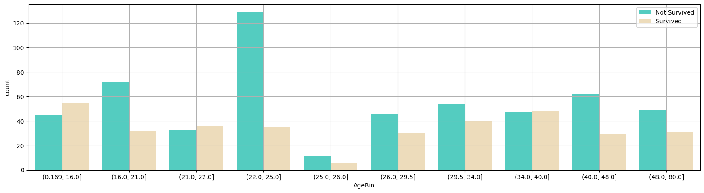
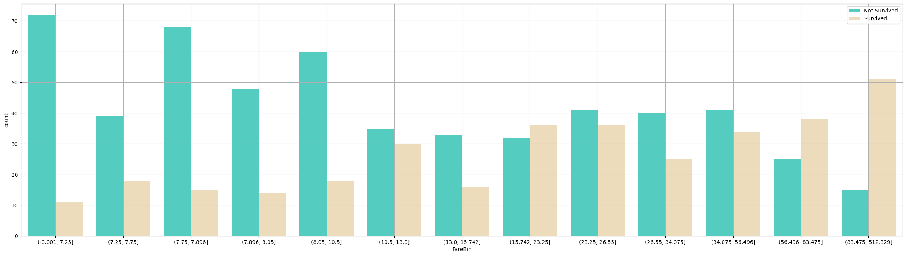
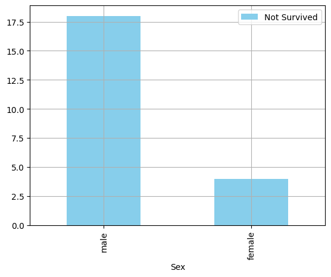
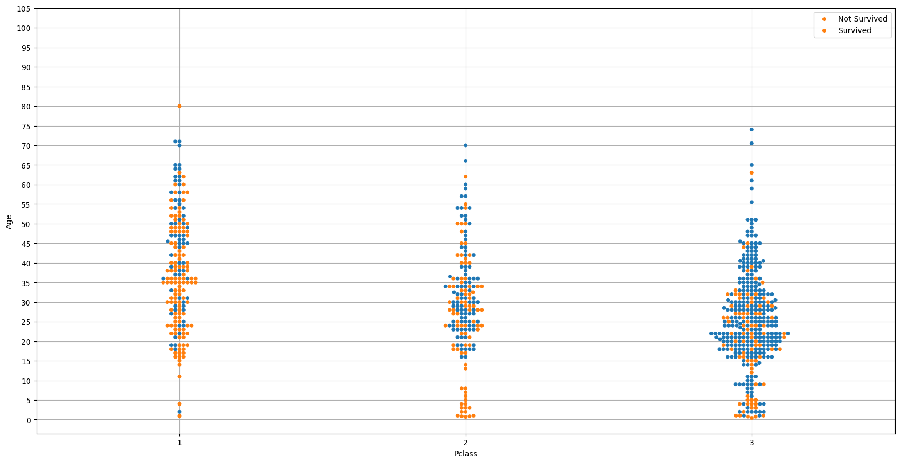
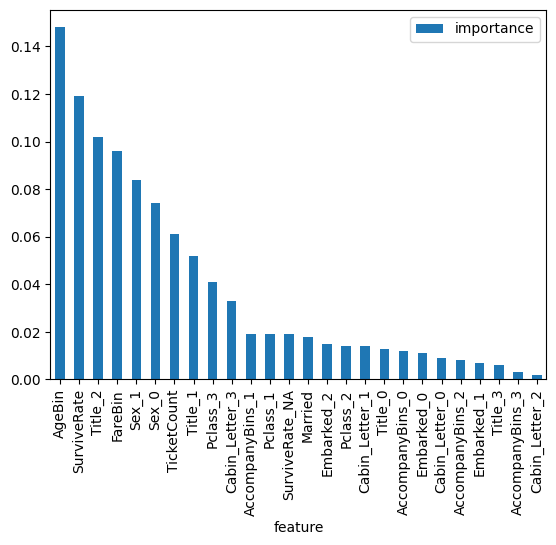
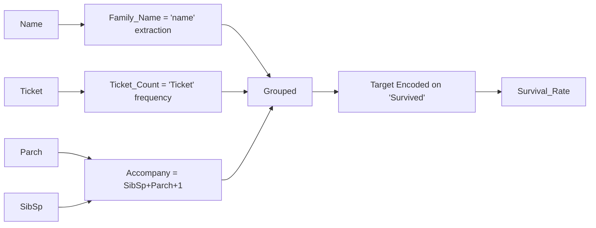
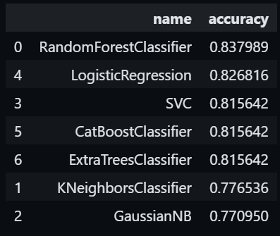
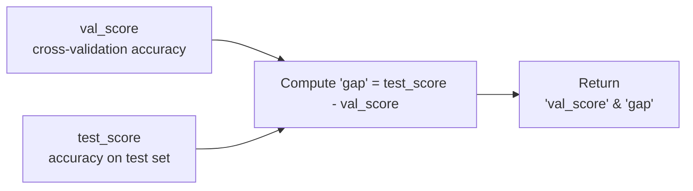
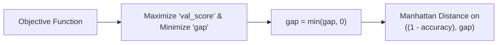

# Titanic Competition

## Overview 
This is my solution for the Kaggle Competition: [Titanic - Machine Learning From Disaster](https://www.kaggle.com/competitions/titanic). The goal of the competition is to build a Machine Learning model that predicts  whether a passenger survived the Titanic disaster based on their passenger information. 

## Performance 
* Rank: 270/12.885 - top 2.3%
* Leaderboard Accuracy: 82.535%
* Please upvote this [Kaggle Notebook](https://www.kaggle.com/code/hoaiphongnguyen/how-to-get-82-5-in-titanic-leaderboard) if you find helpful - this helps other Kaggler to find it more easily!

## Project Structure 
``` text
|-- Titanic_notebook.ipynb: main file 
|
|-- *.pkl files: Saving trained models
|
|   |--ExtraTreesClassifier.pkl
|   |--GradientBoostingClassifier.pkl
|   |--LogisticRegression.pkl
|   |-- ...
|   |-- XGBClassifier.pkl
|
|-- *.csv files: saving models' predictions for submission.
|
|   |-- lr_tuned.csv
|   |-- forest_tuned.csv
|   |-- ...
|   |-- xg_tuned.csv
```


**If you don't have Kaggle API to fetch the data:**
* DOWNLOAD test.csv and train.csv [here](https://www.kaggle.com/competitions/titanic/data)
* **train.csv and test.csv have to be saved with that EXACT name for the notebook to run**


## Provided Data:
| Variable | Definition | Key |
|----------|-----------|-----|
| survival | Survival | 0 = No, 1 = Yes |
| pclass | Ticket class | 1 = 1st, 2 = 2nd, 3 = 3rd |
| sex | Sex | |
| Age | Age in years | |
| sibsp | number of siblings / spouses aboard the Titanic | |
| parch | number of parents / children aboard the Titanic | |
| ticket | Ticket number | |
| fare | Passenger fare | |
| cabin | Cabin number | |
| embarked | Port of Embarkation | C = Cherbourg, Q = Queenstown, S = Southampton |

## Important info from EDA: 
### 'Age' and 'Fare' carry significant signals to predict survival rate
<p align = 'center'>
    
    
</p>

### 'Sex' and 'Pclass' has noticable direct relationship with survival rate 
<p align = 'center'>
    
    
</p>


## Feature Engineering

### Engineered Features
| Variable | Method of creating | Purpose | 
|----------|--------------------|---------|
| Accompany | SibSp + Parch + 1 | Store family size| 
| Title | Grouping by gender(e.g. Mr., Mrs)/frequency/social_status | Reduce number of categories | 
| Married | One-hot encoding on title 'Mrs' | Differenciating 'Mrs' and 'Ms' | 
| Family Name | Extract the family name from 'name' | Grouping people from same family | 
| Survival Rate | Target encoding on average survial rate of passenger groups | Reduce categories + create signals for classification| 

### Survival_Rate - 2nd most important feature
#### Random Forest's Feature Importance: 
<p align = 'left'>
    
</p>

#### It is created as the following diagram:




## Model Selection
Experimented Models:
* Bootstrap Aggregation Tree-based models: Random Forest, Extra Trees
* Gradient Boosting models: Catboost (suitable for small dataset)
* Logistic Regression
* Supported Vector Machines
* K Nearest Neighbors 
* Gaussian Naive Bayes

### Performance on Validation set:
<p align = 'left'>
    
</p>

### Leaderboard Result after Fine-tuning: 
| Model | Accuracy | 
|-------|----------|
|RandomForestClassifier|82.5%|
|LogisticRegression|80.3%|
|SVC|78%|
|ExtraTreesClassifier|81.3%|
|CatBoostClassifier|77%|
|Voting Classifier (random forest + logistic regression) | 82.5%| 

## Hyper-parameter Tuning: Optuna Framework
#### *model's objective* function



<p center = 'center'>
    
</p>

#### *fine_tune* function
Calculate the distance to the ideal hyperparamter set



<p center = 'left'>
    
</p>


## Reference

This notebook couldn't been completed without referencing the wonderful works of the following authors:
* https://www.kaggle.com/code/thomascharuel/titanic-getting-above-80-accuracy
* https://www.kaggle.com/code/krishnamishras/titanic-prediction-model-84-accuracy
* https://www.kaggle.com/code/abhishek0032/titanic-survival-prediction-feature-engineering
* https://www.kaggle.com/code/vinothan/titanic-model-with-90-accurac
